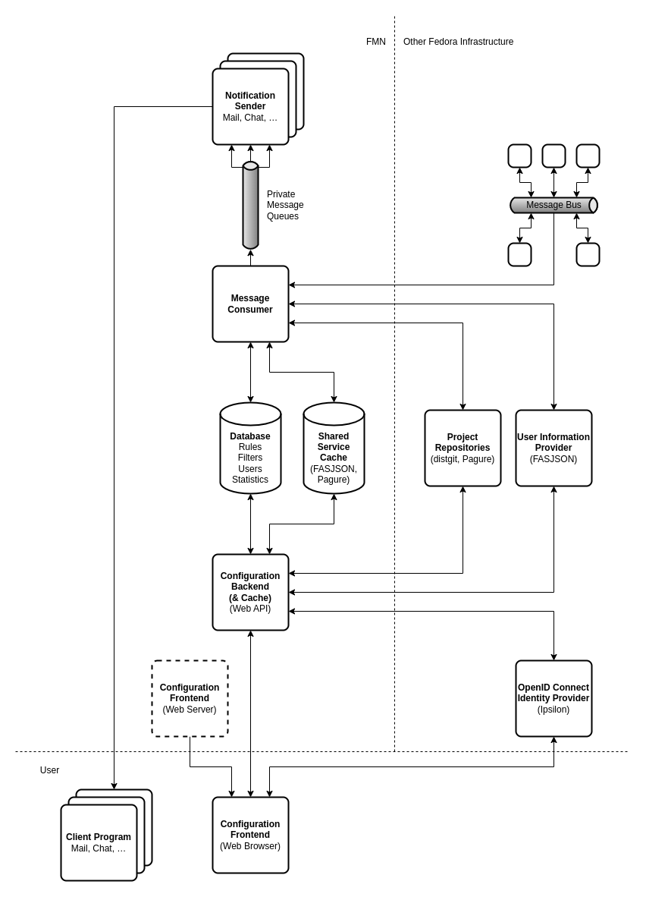

<!--
SPDX-FileCopyrightText: Contributors to the Fedora Project

SPDX-License-Identifier: MIT
-->

# Components

FMN consists of several components, most of which run in Fedora Infrastructure.

## Message Consumer

The *Message Consumer* reads messages carried on the *Message Bus*. If a message is matched by a
rule, it triggers the appropriate [*Notification Sender*](#notification-sender) to send an email or
chat message to the user who set up the rule.

It queries *FASJSON* and *dist-git (Pagure)* for information about users, groups and projects and
stores the information in the [*Shared Service Cache*](#shared-service-cache) (which is also used by
the [*Configuration Backend*](#configuration-backend)) and is responsible for invalidating cached
entries when receiving messages that affected objects have changed.

There can be multiple instances of the *Message consumer*, each will process incoming messages in a
round-robin fashion.

## Notification Sender

A *Notification Sender* receives messages over a private message queue from the [*Message
Consumer*](#message-consumer), triggering it to send notifications to users over various
communication channels, such as IRC, email or Matrix. These messages contain all information a
sender needs to perform the work, no additional lookups in other services are necessary.

Because of how IRC and Matrix work, there can only be one instance of their respective senders.

## Configuration Frontend

The *Configuration Frontend* is an application running in a web browser and is implemented using
`Vue.js`. It lets users configure rules specifying which bus messages they want to be notified about,
e.g.:

- Regarding certain artifacts they’re interested in,
- regarding themselves or groups they are a member of,
- regarding someone else, e.g. a mentee or someone they sponsored.

It communicates with the [*Configuration Backend*](#configuration-backend) over a REST web API which
also acts as an intermediary cache to services like *FASJSON* and *dist-git (Pagure)*.

The *Configuration Frontend* lets users authenticate themselves with *Ipsilon* (our OpenID Connect
identity provider) and uses the token it receives to establish a user’s identity with the
[*Configuration Backend*](#configuration-backend).

## Configuration Backend

The *Configuration Backend* is a service implementing a REST web API using FastAPI and Python. It
lets users manage their notification rules which are stored in the [*Database*](#database).
Additionally, it works as a proxy cache to *FASJSON* and *dist-git (Pagure)* using the [*Shared
Service Cache*](#shared-service-cache) which is also used by the [*Message
Consumer*](#message-consumer).

The [*Configuration Frontend*](#configuration-frontend) which uses the web API on behalf of a user
establishes their identity to the *Configuration Backend* using the token it got from the *OpenID
Connect Identity Provider (Ipsilon)*.

## Shared Service Cache

The *Shared Service Cache* is used by the [*Message Consumer*](#message-consumer) and the
[*Configuration Backend*](#configuration-backend). It is implemented using the `cashews` Python
package and uses `Redis` as a data store.

## Database

The *Database* is used to store the rules describing which messages users want to be notified about,
as well as the number of notifications generated by a rule, to produce statistics for users and
administrators.

It is implemented as a `PostgreSQL` RDBMS and accessed by the [*Message
Consumer*](#message-consumer) and the [*Configuration Backend*](#configuration-backend) using the
`SQLAlchemy` object relational mapper.
